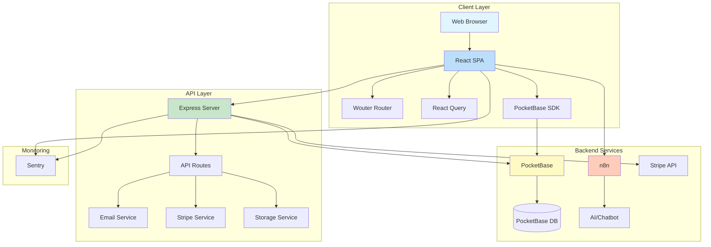
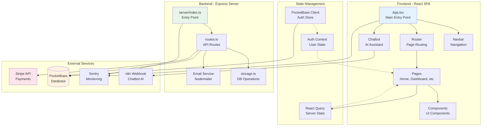
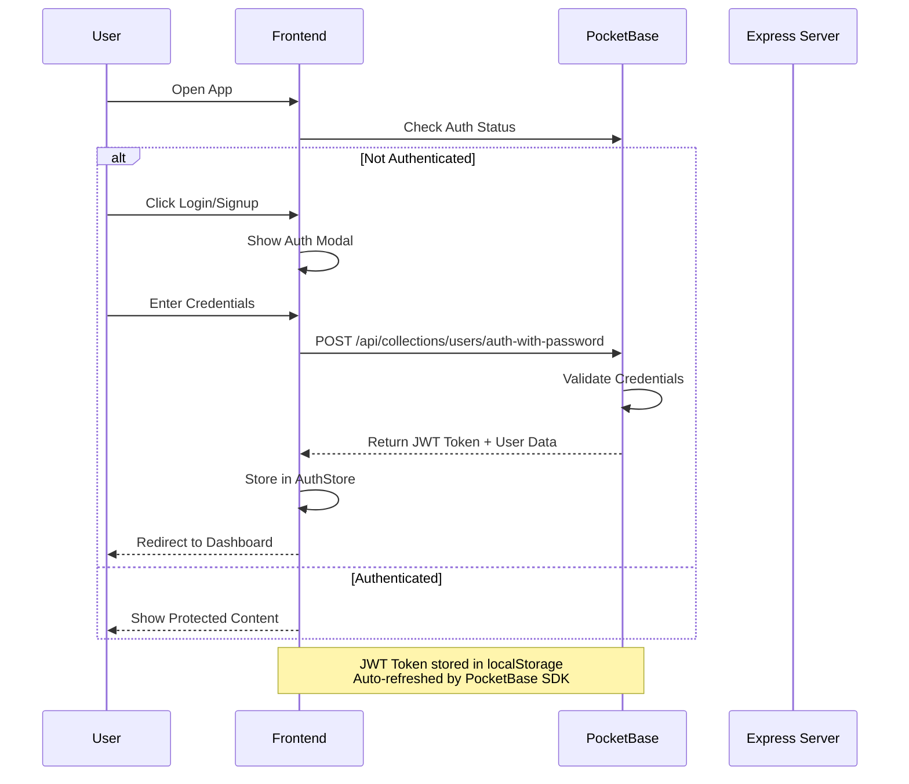
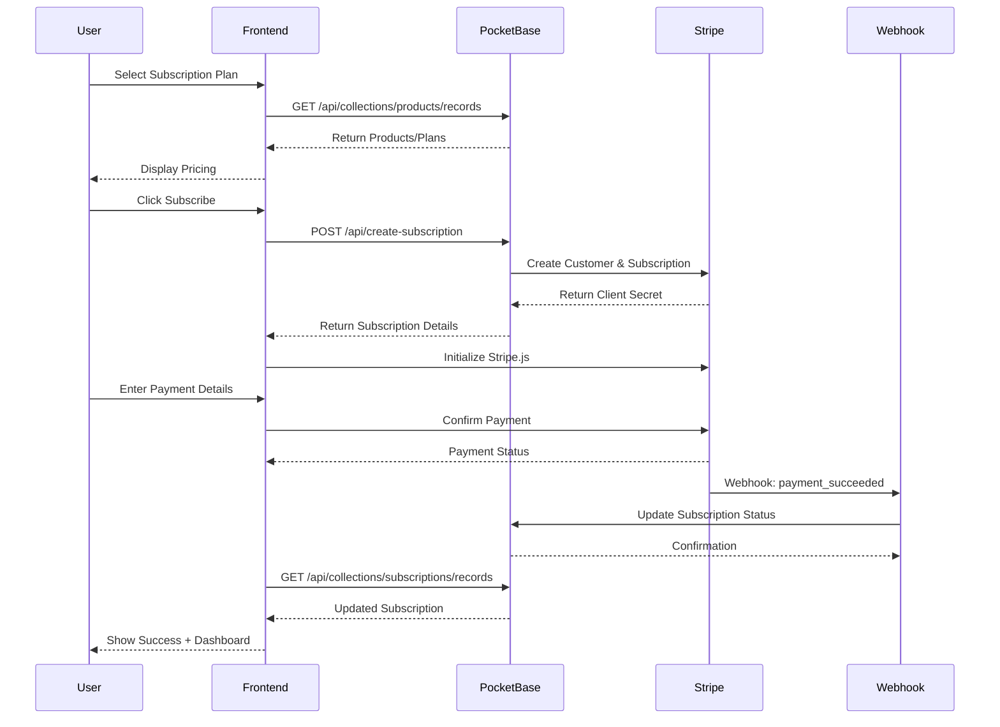
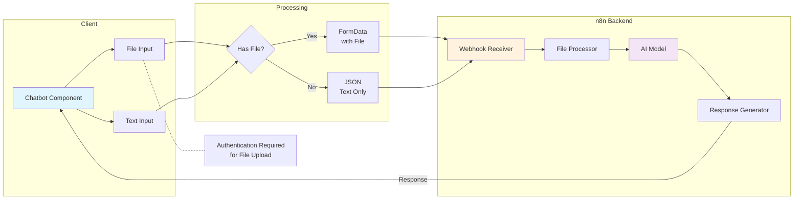
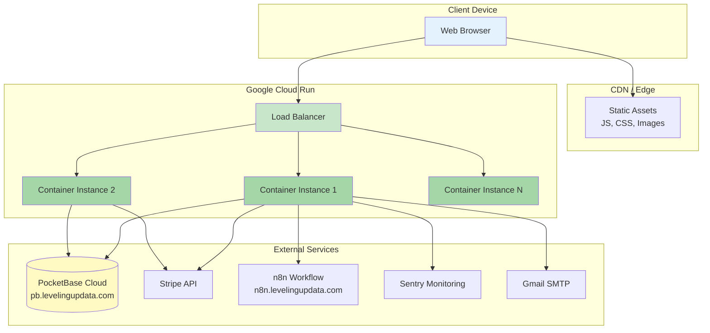
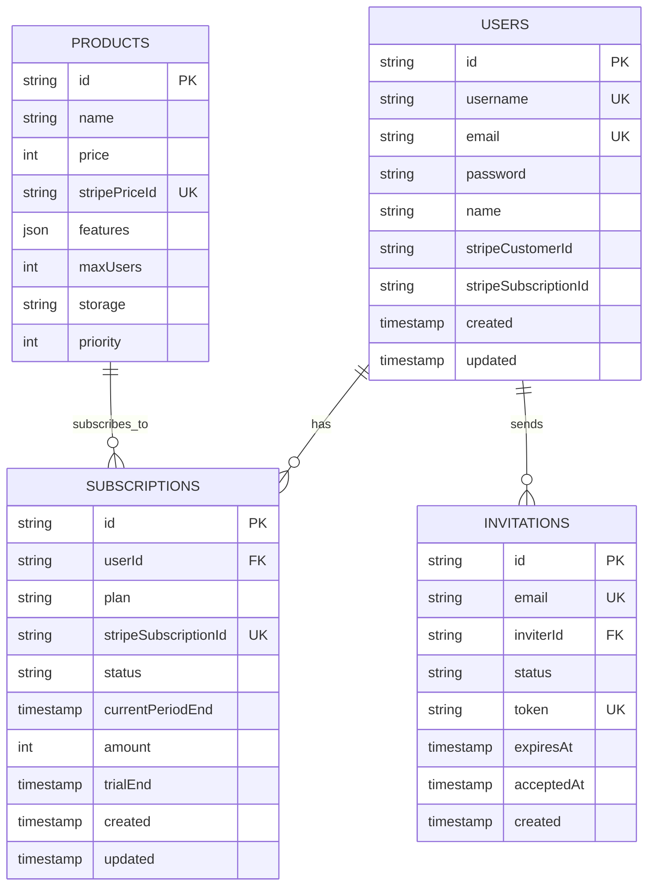
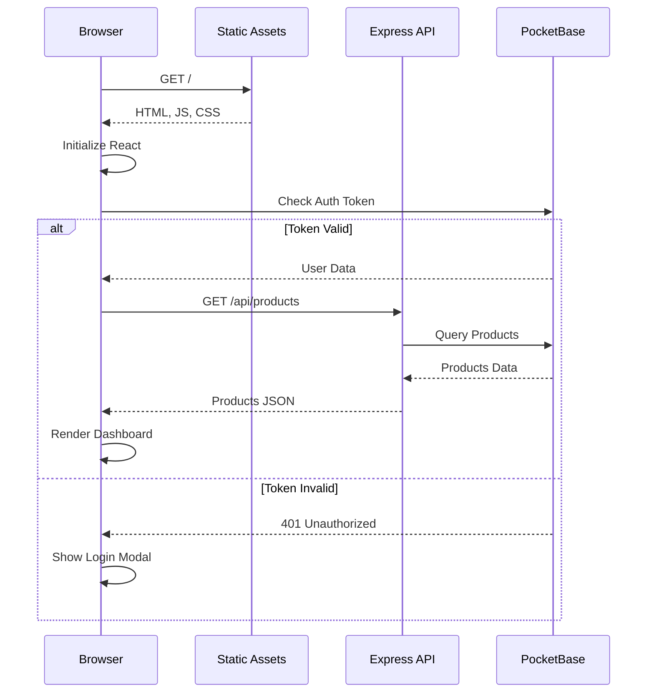
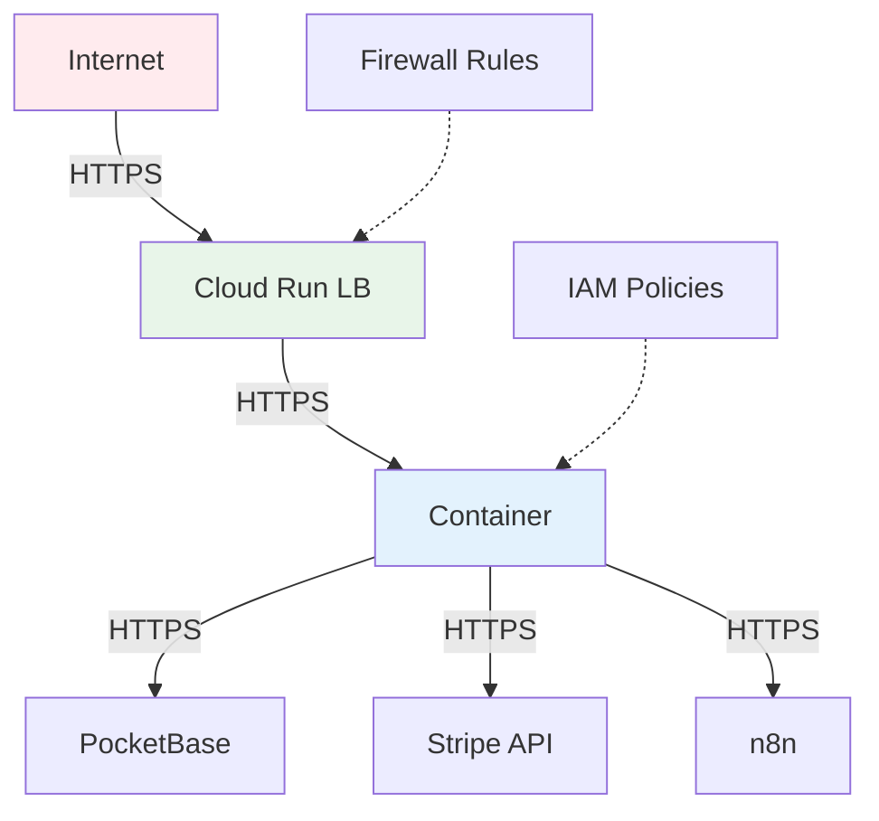

# LUD-SaaS Architecture Documentation

This document provides a comprehensive overview of the LUD-SaaS (Starfish) application architecture, including system design, data flow, and deployment infrastructure.

## Table of Contents

- [System Overview](#system-overview)
- [Architecture Diagrams](#architecture-diagrams)
- [Technology Stack](#technology-stack)
- [System Components](#system-components)
- [Data Flow](#data-flow)
- [Database Schema](#database-schema)
- [Authentication Flow](#authentication-flow)
- [Payment Processing](#payment-processing)
- [Deployment Architecture](#deployment-architecture)
- [Security Architecture](#security-architecture)

## System Overview

LUD-SaaS is a modern, cloud-native SaaS platform that provides:
- User authentication and authorization
- Multi-tier subscription management
- Stripe-based payment processing
- AI-powered chatbot with file processing
- Email notification system
- API token management

### High-Level Architecture



## Architecture Diagrams

### 1. Application Architecture



### 2. User Authentication Flow



### 3. Subscription Payment Flow



### 4. Chatbot Architecture



### 5. Deployment Architecture



### 6. Database Schema (PocketBase)



## Technology Stack

### Frontend

| Technology | Purpose | Version |
|------------|---------|---------|
| React | UI Framework | 18.3.1 |
| TypeScript | Type Safety | 5.6.3 |
| Vite | Build Tool | 5.4.21 |
| Wouter | Routing | 3.3.5 |
| Tailwind CSS | Styling | 3.4.17 |
| shadcn/ui | Component Library | Latest |
| React Query | State Management | 5.60.5 |
| PocketBase SDK | Backend Client | 0.26.2 |
| Stripe.js | Payment UI | 8.0.0 |
| Framer Motion | Animations | 11.13.1 |

### Backend

| Technology | Purpose | Version |
|------------|---------|---------|
| Node.js | Runtime | 18+ |
| Express | Web Framework | 4.21.2 |
| TypeScript | Type Safety | 5.6.3 |
| Drizzle ORM | Database ORM | 0.39.1 |
| Stripe API | Payments | 19.0.0 |
| Nodemailer | Email | 7.0.9 |
| Zod | Schema Validation | 3.24.2 |
| WebSocket | Real-time | 8.18.0 |

### Infrastructure

| Service | Purpose |
|---------|---------|
| PocketBase | Backend as a Service |
| Google Cloud Run | Container Hosting |
| Docker | Containerization |
| Stripe | Payment Processing |
| n8n | Workflow Automation |
| Sentry | Error Monitoring |
| Gmail SMTP | Email Delivery |

## System Components

### Frontend Components

#### 1. Core Components

- **App.tsx** - Root component with providers and error boundary
- **Navbar** - Global navigation with auth state
- **Chatbot** - AI assistant with file upload
- **AuthModal** - Login/registration dialog
- **Footer** - Site footer with links

#### 2. Page Components

- **Home** - Landing page with features
- **Pricing** - Subscription plans
- **Dashboard** - User dashboard with analytics
- **Settings** - User settings and profile
- **Checkout** - Stripe checkout integration
- **Docs** - Documentation viewer

#### 3. UI Components (shadcn/ui)

Complete set of accessible, customizable components:
- Forms: Input, Textarea, Select, Checkbox, Radio
- Dialogs: Dialog, AlertDialog, Sheet, Drawer
- Navigation: Tabs, Accordion, Dropdown Menu
- Feedback: Toast, Alert, Progress, Skeleton
- Data Display: Table, Card, Avatar, Badge

### Backend Components

#### 1. Server Layer

- **server/index.ts** - Main entry point with Sentry integration
- **server/routes.ts** - API route handlers
- **server/storage.ts** - Database operations (Drizzle)
- **server/vite.ts** - Vite dev server integration

#### 2. API Endpoints

- `/api/health` - Health check
- `/api/products` - Product listing
- `/api/send-contact-email` - Contact form
- `/api/send-invite-email` - User invitations
- `/api/webhook` - Stripe webhooks

#### 3. PocketBase Hooks

- **create-subscription.js** - Subscription creation
- **stripe-webhook.js** - Webhook processing
- **users-tokens-generate.js** - API token generation

## Data Flow

### 1. Page Load Flow



### 2. Real-time Updates

PocketBase provides real-time subscriptions:
- Subscribe to collection changes
- Receive instant updates via WebSocket
- Auto-sync UI with server state

## Database Schema

### Tables/Collections

#### Users (Auth Collection)
- Authentication and profile data
- Stripe customer linking
- Created by PocketBase auth system

#### Subscriptions
- User subscription status
- Stripe subscription linking
- Payment period tracking

#### Products
- Available subscription tiers
- Stripe price linking
- Feature lists and limits

#### Invitations
- User invitation system
- Token-based invites
- Expiration tracking

### Indexes

PocketBase automatically creates indexes on:
- Primary keys (id)
- Unique fields (email, username, stripeSubscriptionId)
- Foreign keys (userId)

## Authentication Flow

### JWT-based Authentication

1. **Login/Registration** - User submits credentials to PocketBase
2. **Token Generation** - PocketBase generates JWT token
3. **Client Storage** - Token stored in localStorage via SDK
4. **Auto-refresh** - SDK automatically refreshes token before expiry
5. **Request Authentication** - Token sent in Authorization header
6. **Server Validation** - PocketBase validates token on each request

### Authorization Rules

PocketBase collection rules:
```javascript
// Example: Subscriptions collection
// List Rule
userId = @request.auth.id

// View Rule
userId = @request.auth.id

// Create Rule
userId = @request.auth.id

// Update Rule
userId = @request.auth.id
```

## Payment Processing

### Stripe Integration

#### Setup
1. Customer created in Stripe
2. Subscription created with price ID
3. Payment intent generated
4. Client confirms payment
5. Webhook updates subscription status

#### Webhook Events
- `customer.subscription.updated` - Subscription changes
- `customer.subscription.deleted` - Cancellation
- `invoice.payment_succeeded` - Successful payment
- `invoice.payment_failed` - Failed payment

#### Security
- Webhook signature verification
- Idempotent webhook handling
- Secure key management

## Deployment Architecture

### Google Cloud Run

#### Container Configuration
```yaml
CPU: 1 vCPU
Memory: 1GB
Port: 8080
Min Instances: 0 (scale to zero)
Max Instances: 10
Concurrency: 80 requests/instance
Timeout: 300 seconds
```

#### Build Process
1. **Build Client** - Vite builds React app to `dist/`
2. **Build Server** - TypeScript compiled
3. **Docker Image** - Multi-stage build
4. **Push to GCR** - Google Container Registry
5. **Deploy** - Cloud Run pulls and deploys

#### Environment Variables
- Set via Cloud Run console or CLI
- Encrypted at rest
- Available to container at runtime

### CI/CD Pipeline

Using Cloud Build:
1. Push to GitHub triggers build
2. Cloud Build executes `cloudbuild.yaml`
3. Runs tests and builds
4. Creates Docker image
5. Deploys to Cloud Run
6. Health check verification

## Security Architecture

### Application Security

#### Frontend
- XSS Prevention - React's built-in escaping
- CSRF Protection - JWT in Authorization header
- Secure Storage - httpOnly cookies or localStorage
- Input Validation - Zod schemas

#### Backend
- Input Validation - Zod schemas on all inputs
- SQL Injection Prevention - Parameterized queries (Drizzle)
- Rate Limiting - Cloud Run built-in
- Error Handling - Sentry monitoring
- Secrets Management - Environment variables

#### Data Protection
- HTTPS Enforced - Cloud Run automatic
- Data Encryption - At rest (PocketBase/Cloud)
- Password Hashing - bcrypt (PocketBase)
- Token Expiration - JWT with expiry

### Network Security



### Monitoring and Observability

#### Sentry Integration
- Error tracking and reporting
- Performance monitoring
- User session replay
- Custom breadcrumbs

#### Logging
- Structured JSON logs
- Request/response logging
- Error stack traces
- Performance metrics

#### Metrics
- Response times
- Error rates
- Subscription conversions
- User activity

## Scalability Considerations

### Horizontal Scaling
- Cloud Run auto-scales based on load
- Stateless design for easy scaling
- PocketBase handles high concurrency

### Performance Optimization
- React code splitting
- Lazy loading routes
- Image optimization
- CDN for static assets
- React Query caching

### Database Optimization
- PocketBase indexes
- Efficient queries
- Connection pooling
- Real-time subscriptions

## Future Enhancements

### Planned Features
- [ ] Multi-tenancy support
- [ ] Advanced analytics dashboard
- [ ] Mobile app (React Native)
- [ ] API rate limiting per user
- [ ] Team collaboration features
- [ ] Webhook management UI
- [ ] Advanced reporting
- [ ] Integration marketplace

### Technical Improvements
- [ ] Redis caching layer
- [ ] GraphQL API option
- [ ] Microservices architecture
- [ ] Kubernetes deployment
- [ ] A/B testing framework
- [ ] Advanced monitoring (Datadog/New Relic)

---

**Last Updated:** October 2024  
**Architecture Version:** 1.0  
**Maintained by:** Leveling Up Data Team

